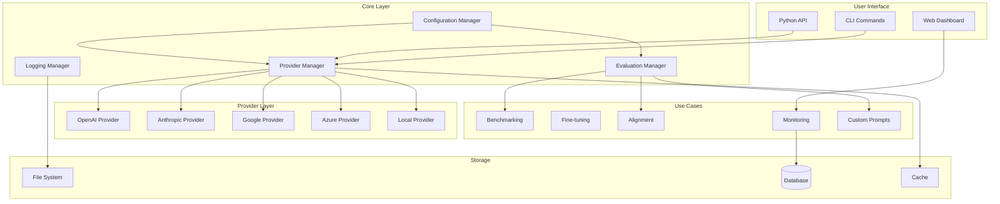
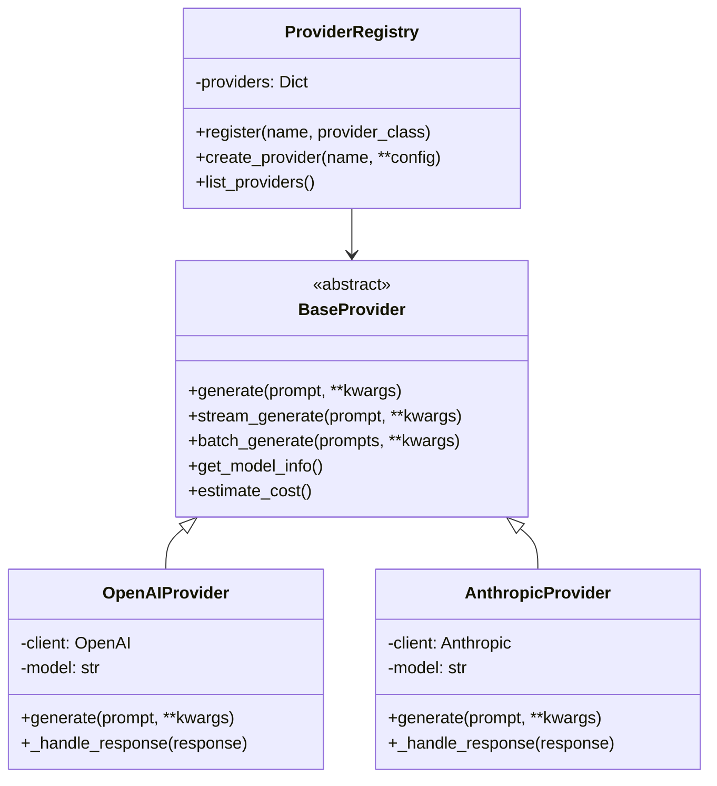
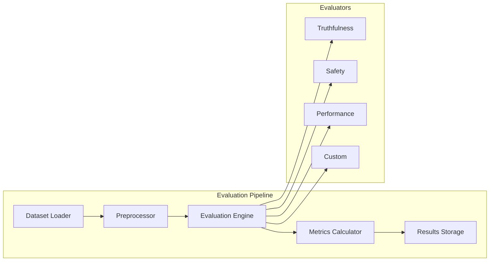
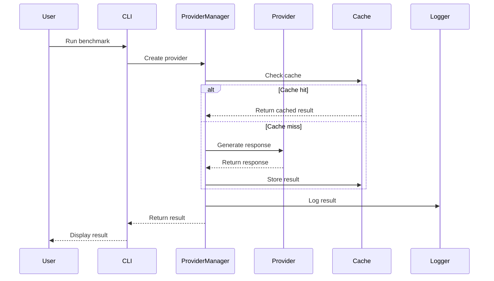
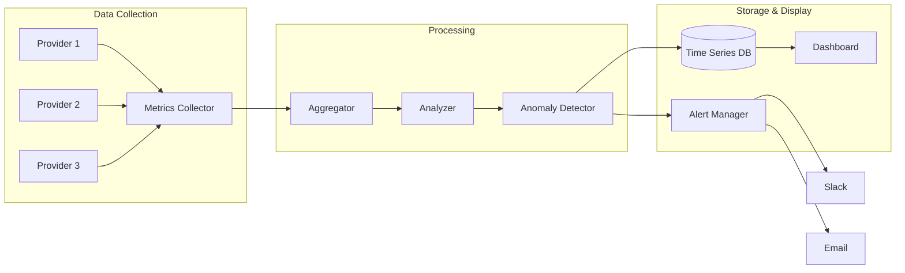
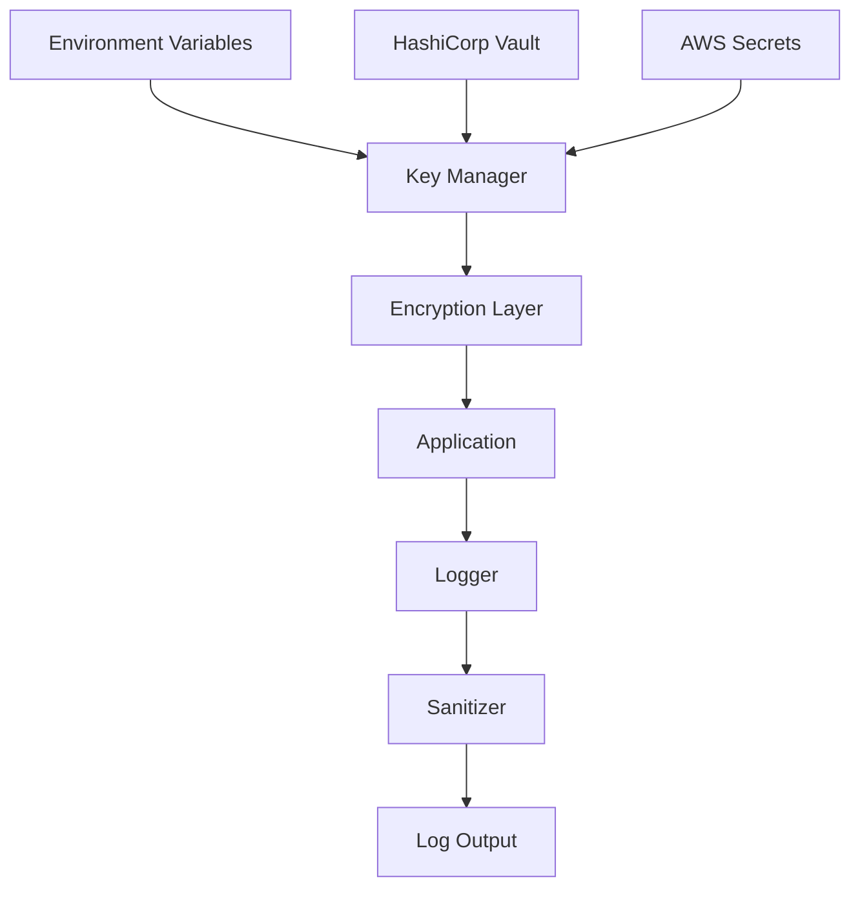

# LLM Lab Architecture

## Overview

LLM Lab follows a modular, extensible architecture designed for flexibility and maintainability.

## System Architecture



## Component Architecture

### Provider Architecture



### Evaluation Architecture



## Data Flow

### Request Flow



### Monitoring Data Flow



## Directory Structure

```
llm-lab/
├── src/                        # Source code
│   ├── providers/              # Provider implementations
│   │   ├── base.py            # Abstract base provider
│   │   ├── openai.py          # OpenAI implementation
│   │   ├── anthropic.py       # Anthropic implementation
│   │   └── registry.py        # Provider registry
│   ├── evaluation/            # Evaluation logic
│   │   ├── metrics.py         # Metric calculations
│   │   ├── evaluators.py      # Evaluator implementations
│   │   └── datasets.py        # Dataset handling
│   ├── analysis/              # Analysis tools
│   │   ├── comparator.py      # Result comparison
│   │   └── visualizer.py      # Visualization
│   └── use_cases/             # High-level use cases
│       ├── benchmarking.py    # Benchmarking workflows
│       ├── fine_tuning.py     # Fine-tuning workflows
│       └── monitoring.py      # Monitoring setup
├── tests/                     # Test suite
│   ├── unit/                  # Unit tests
│   ├── integration/           # Integration tests
│   └── fixtures/              # Test fixtures
├── examples/                  # Usage examples
├── docs/                      # Documentation
└── config/                    # Configuration files
```

## Design Patterns

### Factory Pattern

Provider creation uses the factory pattern:

```python
# Provider factory
class ProviderFactory:
    @staticmethod
    def create(provider_type: str, **config) -> BaseProvider:
        if provider_type == "openai":
            return OpenAIProvider(**config)
        elif provider_type == "anthropic":
            return AnthropicProvider(**config)
        # ...
```

### Strategy Pattern

Evaluation strategies are pluggable:

```python
# Evaluation strategy
class EvaluationStrategy(ABC):
    @abstractmethod
    def evaluate(self, response: str, expected: str) -> float:
        pass

class ExactMatchStrategy(EvaluationStrategy):
    def evaluate(self, response: str, expected: str) -> float:
        return 1.0 if response == expected else 0.0
```

### Observer Pattern

Monitoring uses observers for metrics:

```python
# Metric observer
class MetricObserver(ABC):
    @abstractmethod
    def update(self, metric: Metric) -> None:
        pass

class DashboardObserver(MetricObserver):
    def update(self, metric: Metric) -> None:
        self.dashboard.update_metric(metric)
```

## Scalability Considerations

### Horizontal Scaling

- **Stateless design**: All components are stateless
- **Load balancing**: Distribute requests across providers
- **Caching**: Redis/Memcached for response caching

### Performance Optimization

- **Connection pooling**: Reuse HTTP connections
- **Batch processing**: Group requests to providers
- **Async operations**: Non-blocking I/O for better throughput

### Reliability

- **Circuit breakers**: Prevent cascading failures
- **Retries**: Exponential backoff for transient errors
- **Fallbacks**: Alternative providers when primary fails

## Security Architecture

### API Key Management



### Data Privacy

- **PII detection**: Automatic detection and masking
- **Audit logging**: Track all data access
- **Encryption**: At-rest and in-transit encryption

## Extension Points

### Adding New Providers

1. Extend `BaseProvider`
2. Implement required methods
3. Register with `ProviderRegistry`
4. Add configuration schema

### Adding New Evaluators

1. Create evaluator class
2. Implement evaluation logic
3. Register with evaluation system
4. Add to use case workflows

### Custom Metrics

1. Define metric interface
2. Implement calculation logic
3. Add to metrics registry
4. Update dashboard displays

## Future Architecture

### Planned Enhancements

- **Plugin system**: Dynamic provider loading
- **Distributed execution**: Multi-node benchmarking
- **ML pipeline integration**: MLflow/Kubeflow support
- **GraphQL API**: Flexible data queries

For implementation details, see the [API documentation](../api/README.md).
